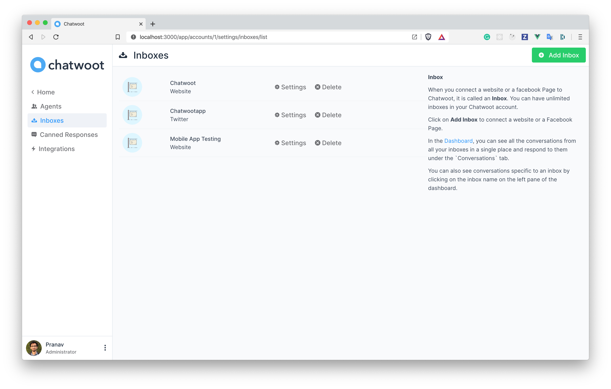
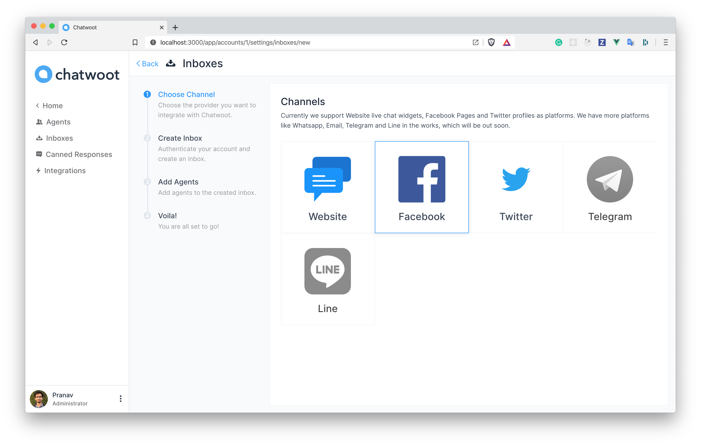
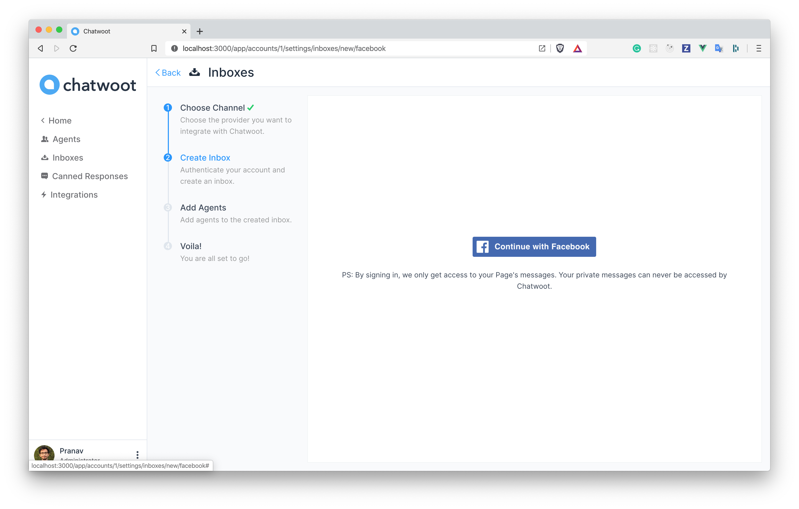
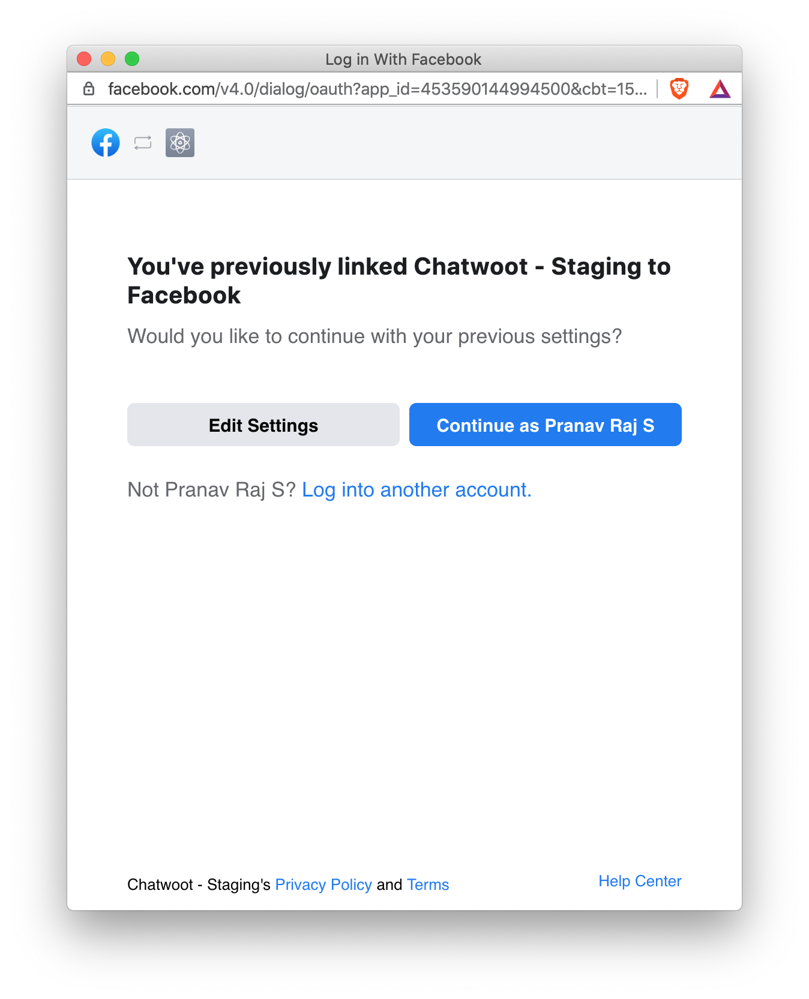
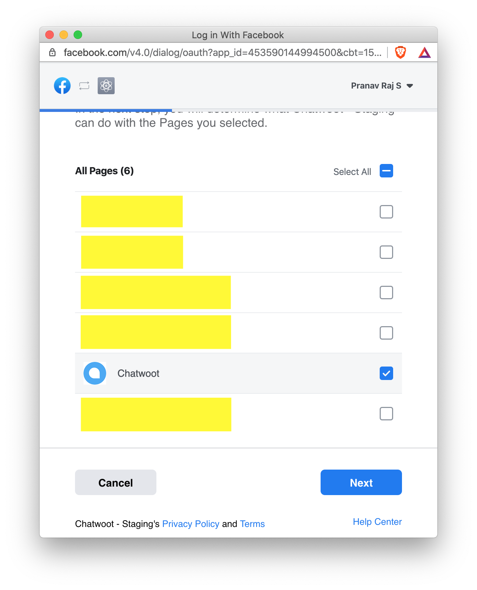
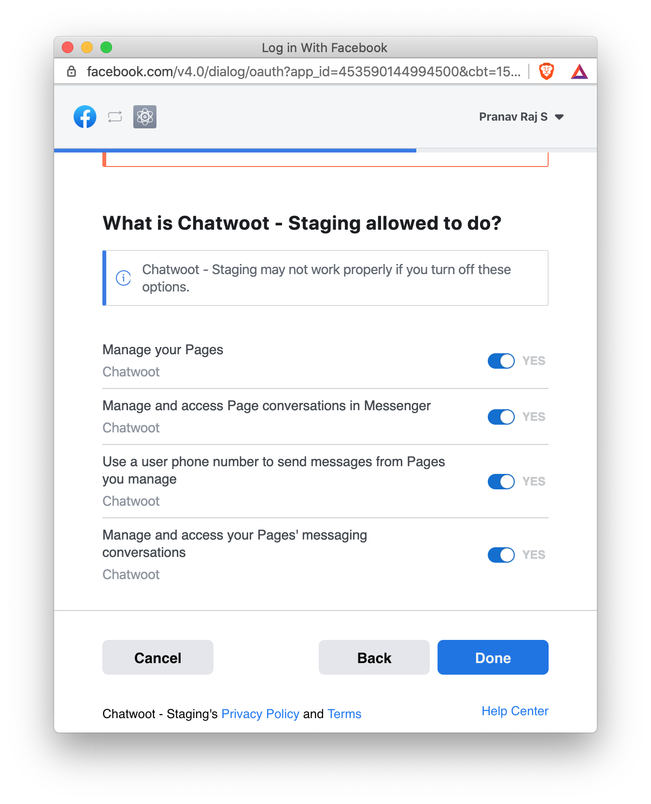
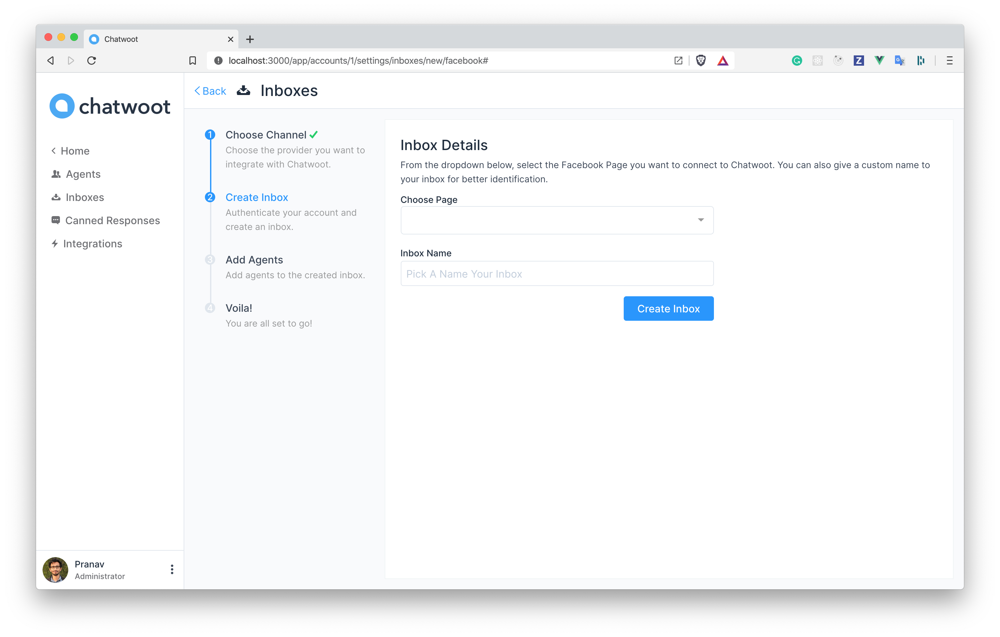
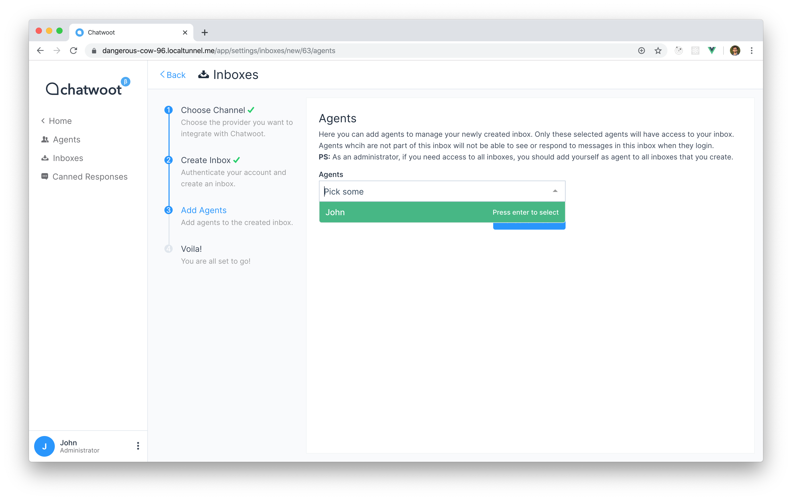
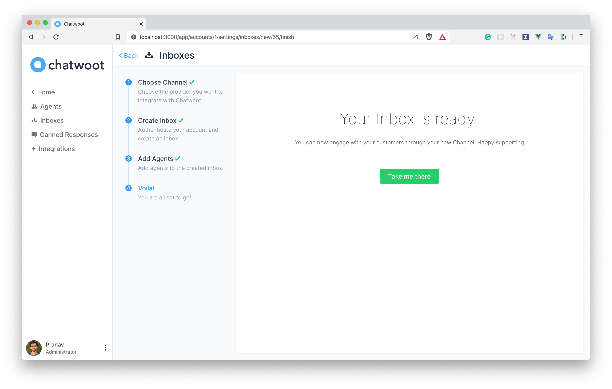
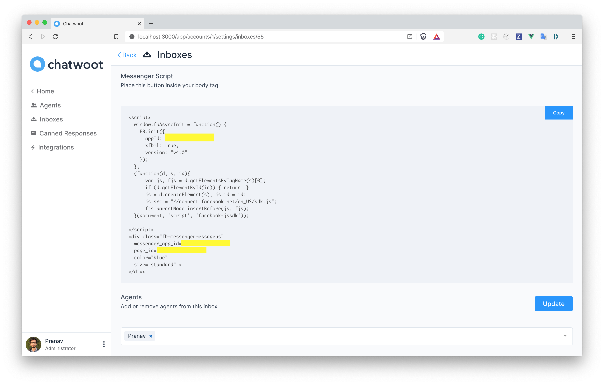

# facebook-channel

If you are using a self-hosted Chatwoot installation, please configure the Facebook app as described in the [guide to setup Facebook app](https://github.com/chatwoot/docs/tree/2d5c23bd385463751573600a0f937188aace738f/docs/facebook-setup/README.md)

**Step 1**. Click on "Add Inbox" button from Settings &gt; Inboxes page.

**Step 2**. Click on "Facebook" icon.

**Step 3**. Click on Facebook login button. It will open a new window for you to login.

**Step 4**. Authenticate with Facebook and select the page you want to connect. Enable all permissions shown in the list, otherwise the app might not work.

**Step 5**. "Add agents" to your Facebook inbox.

**Step 6**. Hooray! You have successfully created a Facebook inbox. Whenever a customer sends a message to your Facebook page, you will be able to see it here and manage it.

**Step 7**. If you want to update the agents who have access to the inbox, you can go to Settings &gt; Inboxes.

