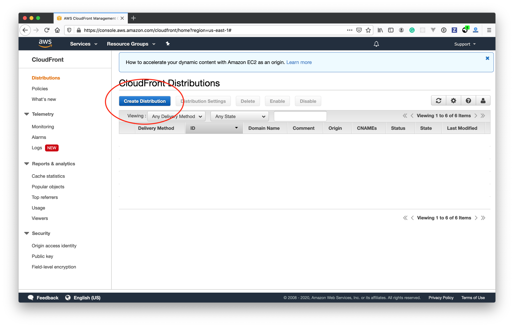
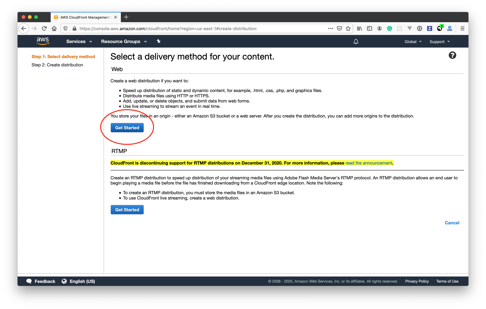
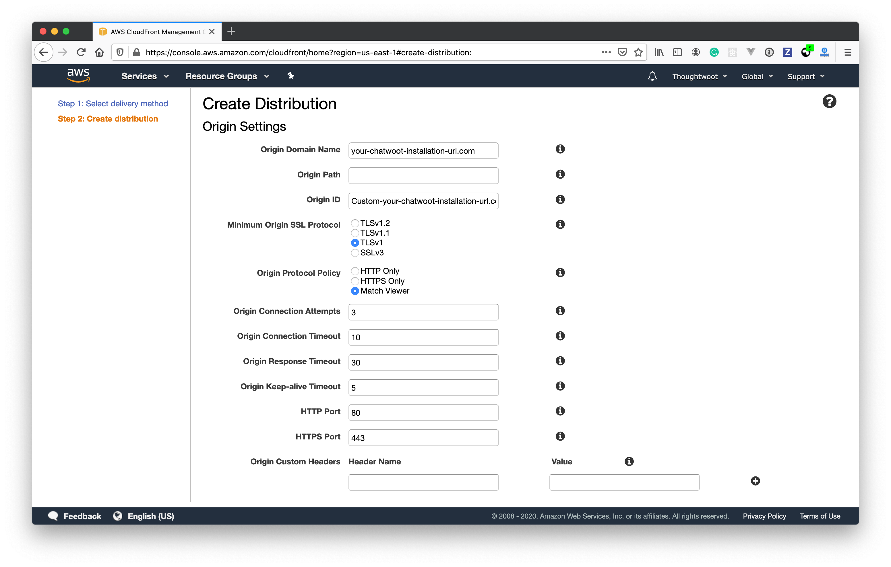
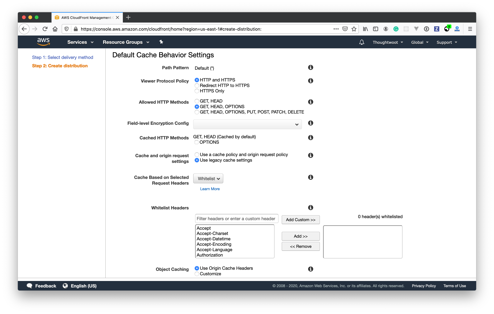
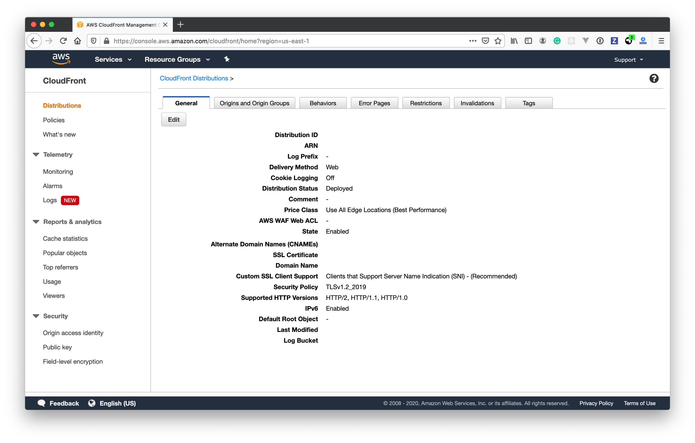

# cloudfront-cdn

This document helps you to configure Cloudfront as the asset host for Chatwoot. If you have a high traffic website, we would recommend setting up a CDN for Chatwoot.

## Configure a Cloudfront distribution

**Step 1**: Create a Cloudfront distribution.



**Step 2**: Select "Web" as delivery method for your content.



**Step 3**: Configure the Origin Settings as the following.



* Provide your Chatwoot Installation URL under Origin Domain Name.
* Select "Origin Protocol Policy" as Match Viewer.

**Step 4**: Configure Cache behaviour.



* Configure **Allowed HTTP methods** to use _GET, HEAD, OPTIONS_.
* Configure **Cache and origin request settings** to use _Use legacy cache settings_.
* Select **Whitelist** for _Cache Based on Selected Request Headers_.
* Add the following headers to the **Whitelist Headers**.

  

  * **Access-Control-Request-Headers**
  * **Access-Control-Request-Method**
  * **Origin**

**Step 5**: Click on **Create Distribution**. You will be able to see the distribution as shown below. Use the **Domain name** listed in the details as the **ASSET\_CDN\_HOST** in Chatwoot.



## Add ASSET\_CDN\_HOST in Chatwoot

Your Cloudfront URL will be of the format `<distribution>.cloudfront.net`.

Set

```bash
ASSET_CDN_HOST=<distribution>.cloudfront.net
```

in the environment variables.

